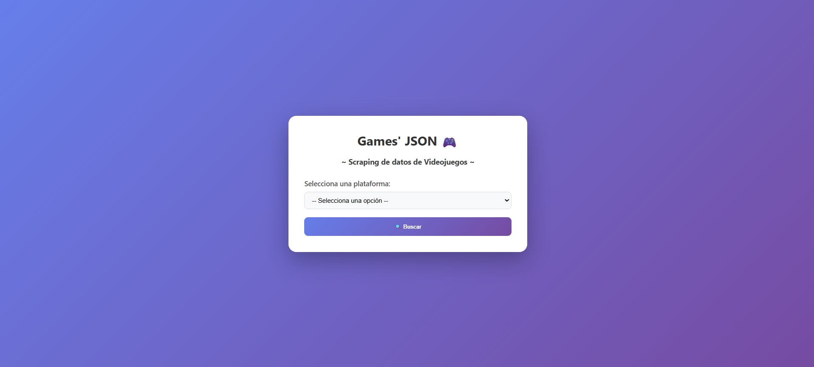
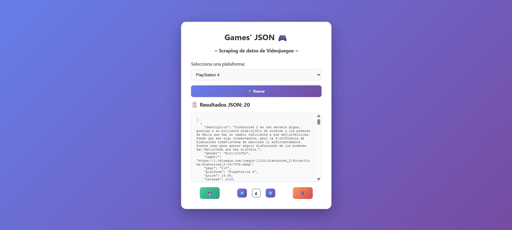

# 🎮 Games JSON - Scraper

App SSR (Server-Side Rendering) cuya finalidad es proveer objetos json con información de videojuegos. Esta información se obtiene escrapeando páginas web de videojuegos.




---

## 🚀 Tecnologías utilizadas

- **Python**
- **Flask** – Servidor web
- **Jinja2** – Plantillas HTML
- **Requests** – Peticiones HTTP
- **Pydantic** – Validación de datos
- **BeautifulSoup4** – Parseo de HTML
- **Dotenv** – Variables de entorno

---

## ✨ Funcionalidades principales

- Interfaz web sencilla para iniciar el scraping
- Scraping de páginas web de videojuegos
- Generación y descarga de un archivo JSON con la información obtenida
- Registrar los datos obtenidos en una base de datos externa a través de una API

---

## 📂 Estructura relevante

- `src/` - código fuente
  - `parsers/` - parseo de páginas
  - `scrapers/` - lógica de scraping por plataforma
  - `requests/` - capas de peticiones
  - `services/` - utilidades, creación de archivos
  - `models/` - modelos de datos
  - `templates/` y `static/` - interfaz web
  - `temp/` - archivos JSON generados (no versionar)
- `config.py` - configuración central
- `run.py` - punto de entrada

---

## ⚙️ Instalación local

1. Clona este repositorio:

```bash
git clone https://github.com/Gdr18/videogames-scraper.git
cd videogames-scraper
```

2. Crea y activa un entorno virtual:

```bash
python -m venv venv
venv\Scripts\activate
```

3. Instala las dependencias:

```bash
pip install -r requirements.txt
```

4. Crea un archivo `.env` en la raíz del proyecto con las siguientes variables de entorno:

```bash
API_URL=https://localhost:5000
API_EMAIL=admin_user@gmail.com
API_PASSWORD=*******
ENVIRONMENT=development
URL_PARSER=https://www.videojuegos.com/{platform}/juegos/mejores/{page}
URL_PARSER_SWITCH_2=https://www.videojuegos.com/{platform}/juegos/{page}
```

- `API_URL`: URL base de la API
- `API_EMAIL`: Correo electrónico del usuario administrador (en el caso de que haga falta login)
- `API_PASSWORD`: Contraseña del usuario administrador (en el caso de que haga falta login)
- `ENVIRONMENT`: Entorno de ejecución (`development` o `production`)
- `URL_PARSER`: URL base para el scraping
- `URL_PARSER_SWITCH_2`: URL alternativa para el scraping de Nintendo Switch 2

5. Ejecuta la aplicación:

```bash
python run.py
```

---

## 👩‍💻 Autor

Desarrollado por **Gádor García Martínez**  
[GitHub](https://github.com/Gdr18) · [LinkedIn](https://www.linkedin.com/in/g%C3%A1dor-garc%C3%ADa-mart%C3%ADnez-99a33717b/)
